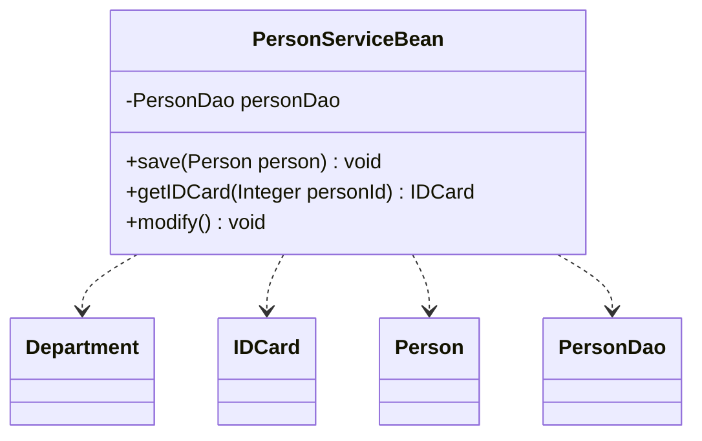
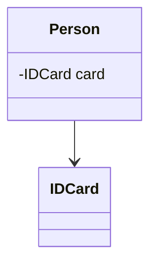
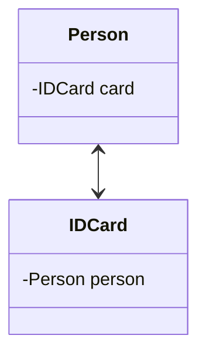
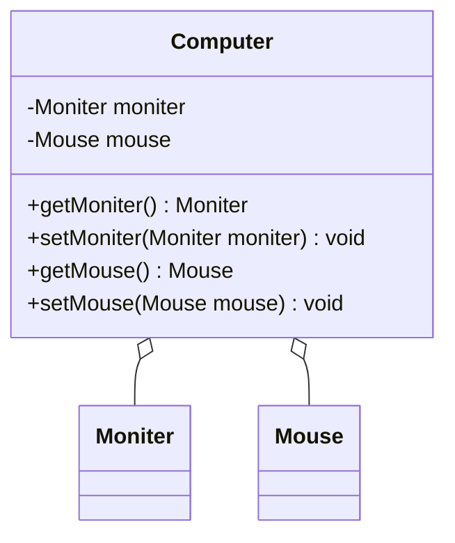
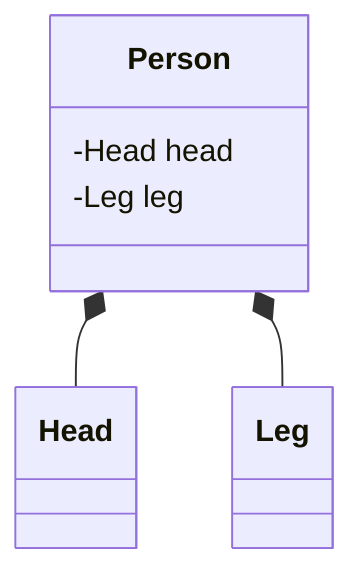
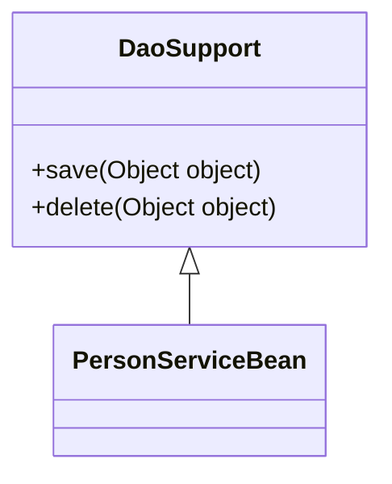
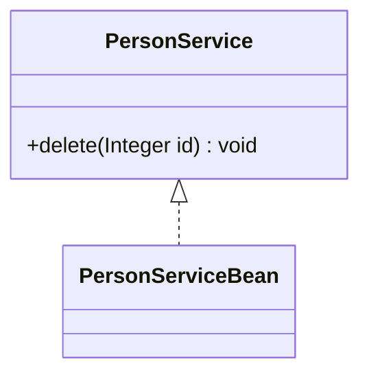

# 1.设计模式引导
## 1.1.设计模式起源
    模式的概念
    在介绍设计模式的起源之前,需要先介绍一个位于设计模式之上的概念,这个概念就是模式,设计模式是模式的一个分支,模式起源于建筑工程领域,最开始由是建筑工程领域提出。Christopher Alexander博士及其研究团队用了约20年的时间,对住宅和周边环境进行了大量的调查研究和资料收集工作,发现人们对舒适住宅和城市环境存在一些共同的认同规律,并在他的著作中把这些认同规律归纳为253个模式,对每一个模式(Pattern)都从Context(前提条件)、Theme或Problem(目标问题)、 Solution(解决方案)三个方面进行了描述,并给出了从用户需求分析到建筑环境结构设计直至经典实例的过程模型。在他的另一部经典著作《建筑的永恒之道》中,他给出了关于模式的定义:每个模式都描述了一个在我们的环境中不断出现的问题,然后描述了该问题的解决方案的核心,通过这种方式,我们可以无数次地重用那些已有的成功的解决方案，无须再重复相同的工作。这个定义可以简单地用一句话表示:模式是在特定环境下人们解决某类重复出现问题的一套成功或有效的解决方案。

    Gof四人组与23中设计模式的诞生
    1990年,软件工程界开始关注ChristopherAlexander等在这一住宅、公共建筑与城市规划领域的重大突破。最早将模式的思想引入软件工程方法学的是1991-1992年以"四人组(Gang of Four，简称GoF,分别是Erich Gamma, Richard Helm, Ralph Johnson和John Vlissides)"自称的四位著名软件工程学者,他们在1994年归纳发表了23种在软件开发中使用频率较高的设计模式,旨在用模式来统一沟通面向对象方法在分析、设计和实现间的鸿沟。

    模式、软件模式、设计模式
    GoF将模式的概念引入软件工程领域,这标志着软件模式的诞生。软件模式(Software Patterns)是将模式的一般概念应用于软件开发领域,即软件开发的总体指导思路或参照样板。软件模式并非仅限于设计模式,还包括架构模式、分析模式和过程模式等。
## 1.2.设计模式是什么
    设计模式(Design Pattern)是一套被反复使用、多数人知晓的、经过分类编目的、代码设计经验的总结,使用设计模式是为了可重用代码、让代码更容易被他人理解并且保证代码可靠性。其本质是是对类的封装性、继承性和多态性，以及类的关联关系和组合关系的充分理解,也可以说其本质是对面向对象开发的充分理解。
## 1.3.设计模式作用
    a.设计模式以一种标准的方式供广大开发人员使用,为开发者的沟通提供了一套机制,帮助开发者更好地明白和更清晰地描述一段被给出的代码。
    b.设计模式同样让开发人员之间有一套"共享词汇",一旦懂这些词汇,开发人员之间沟通这些观念就很容易,也会促使那些不懂的程序员想开始学习设计模式。
    c.设计模式可以使开发人员更加方便简单复用成功的设计模式和结构
    d.设计模式可以使人们深入理解面向对象的设计思想,提高软件的开发效率,节约设计成本。
## 1.4.设计模式分类
    Gof提出的设计模式共23种,可以分为三种类型
    创建型模式
    单例模式、抽象工厂模式、建造者模式、工厂模式、原型模式。

    结构型模式
    适配器模式、桥接模式、装饰模式、组合模式、外观模式、享元模式、代理模式。

    行为型模式
    模版方法模式、命令模式、迭代器模式、观察者模式、中介者模式、备忘录模式、解释器模式、状态模式、策略模式、职责链模式、访问者模式。
# 2.类与类之间的六种关系
## 2.1.依赖关系
### 2.1.1.依赖关系概述
    依赖关系(Dependence),只要是在类中用到了对方,那么它们之间就存在依赖关系。如果没有对方,无法通过编译。

    在代码中表现为
    a.类中用到了对方
    b.是类的成员属性
    c.是方法的返回类型
    d.是方法接收的参数类型
    e.方法中使用到
### 2.1.2.UML箭头及指向
    带箭头的虚线，指向被使用者
### 2.1.3.依赖关系类图

### 2.1.4.依赖关系代码
    Department.java
```java
package expand.uml.dependence;

public class Department {
}
```
    IDCard.java
```java
package expand.uml.dependence;

public class IDCard {
}
```
    Person.java
```java
package expand.uml.dependence;

public class Person {
}
```
    PersonDao.java
```java
package expand.uml.dependence;

public class PersonDao {
}
```
    PersonServiceBean.java
```java
package expand.uml.dependence;

public class PersonServiceBean {
    private PersonDao personDao;
    public void save(Person person){}
    public IDCard getIDCard(Integer personId){
        return null;
    }
    public void modify(){
        Department department = new Department();
    }
}
```
## 2.2.关联关系
### 2.2.1.关联关系概述
    关联关系(Association),实际上就是类与类之间的联系,它是依赖关系的特例。关联关系具有导航性:即双向关联关系或单向关联关系
### 2.2.2.UML箭头及指向
    带普通箭头的实线,拥有者指向被拥有者
### 2.2.3.关联关系类图
    单向关联关系

    双向关联关系

### 2.2.4.关联关系代码
    单向关联关系
    Person.java
```java
package expand.uml.association.singleone2one;
//一个人只有一个身份证,一个身份证也只能对应一个人；所以身份证跟人是一对一关系
public class Person {
    private IDCard card;
}
```
    IDCard.java
```java
package expand.uml.association.singleone2one;
//若果代码是这样写的话，就是单向一对一的关系。因为Person中有IDCard成员变量，而中IDCard没有Person成员变量
public class IDCard {
}
```
    双向关联关系
    Person.java
```java
package expand.uml.association.doubleone2one;

//因为PersonIDCard中有成员变量，而中IDCard也有Person成员变量，所以这是双向一对一关系
public class Person {
    private IDCard card;
}
```
    IDCard.java
```java
package expand.uml.association.doubleone2one;
//因为Person中有IDCard成员变量，而中IDCard也有Person成员变量，所以这是双向一对一关系
public class IDCard {
    private Person person;
}
```
## 2.3.聚合关系
### 2.3.1.聚合关系概述
    聚合关系(Aggregation)表示的是整体和部分的关系,整体与部分可以分开。聚合关系是关联关系的特例,所以它具有关联的导航性与多重性。
### 2.3.2.UML箭头及指向
    带空心菱形的实心线,菱形指向整体.
### 2.3.3.聚合关系类图

### 2.3.4.聚合关系代码
    Moniter.java
```java
package expand.uml.aggregation;

public class Moniter {
}
```
    Mouse.java
```java
package expand.uml.aggregation;

public class Mouse {
}
```
    Computer.java
```java
package expand.uml.aggregation;

public class Computer {
    //显示器可以和Computer分离
    private Moniter moniter;
    //鼠标可以和Computer分离
    private Mouse mouse;

    public Moniter getMoniter() {
        return moniter;
    }

    public void setMoniter(Moniter moniter) {
        this.moniter = moniter;
    }

    public Mouse getMouse() {
        return mouse;
    }

    public void setMouse(Mouse mouse) {
        this.mouse = mouse;
    }
}
```
## 2.4.组合关系
### 2.4.1.组合关系概述
    组合关系(Composite))表示的是整体和部分的关系,整体与部分不能分开。组合关系是关联关系的一种特例。比如说B类里面用到了一个A类,且这个A类是通过new创建的,也就是说当B类被初始化的时候A类也被初始化了。(耦合度比聚合高)
### 2.4.2.UML箭头及指向
    带实心菱形的实线,菱形指向整体
### 2.4.3.组合关系类图

### 2.4.4.组合关系代码
    Head.java
```java
package expand.uml.composition;

public class Head {
}
```
    Leg.java
```java
package expand.uml.composition;

public class Leg {
}
```
    Person.java
```java
package expand.uml.composition;

public class Person {
    //组合关系，Person和Head是无法分开的
    private Head head = new Head();
    //组合关系，Person和Leg是无法分开的
    private Leg leg = new Leg();
}
```
## 2.5.泛化关系
### 2.5.1.泛化关系概述
    泛化关系(Generalization),泛化关系实际上就是继承关系,它是依赖关系的特例。如果A类继承了B类,我们就说A和B存在泛化关系。
### 2.5.2.UML箭头及指向
    带三角箭头的实线,子类指向父类
### 2.5.3.泛化关系类图

### 2.5.4.泛化关系代码
    DaoSupport.java
```java
package expand.uml.generalization;

public abstract class DaoSupport {
    public void save(Object object){}
    public void delete(Object object){}
}
```
    PersonServiceBean.java
```java
package expand.uml.generalization;

public class PersonServiceBean extends DaoSupport{
}
```
## 2.6.实现关系
### 2.6.1.实现关系概述
    实现关系(Realization),比如某个类实现了一个接口。它也是依赖关系的特例。
### 2.6.2.UML箭头及指向
    带三角箭头的虚线,箭头指向接口
### 2.6.3.实现关系类图

### 2.6.4.实现关系代码
    PersonService.java
```java
package expand.uml.realization;

public interface PersonService {
    public void delete(Integer id);
}
```
    PersonServiceBean.java
```java
package expand.uml.realization;

public class PersonServiceBean implements PersonService{
    @Override
    public void delete(Integer id) {

    }
}
```

# 3.设计模式七大原则
## 3.1.单一职责原则

## 3.2.接口隔离原则

## 3.3.依赖倒转(倒置)原则

## 3.4.里氏替换原则

## 3.5.开闭原则

## 3.6.迪米特法则

## 3.7.合成复用原则